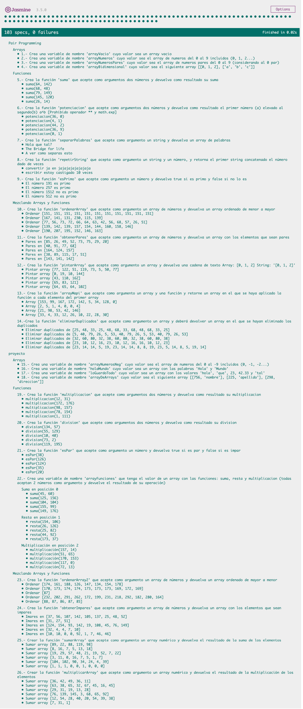

# :european_castle: :crossed_swords: Bikram #

## Introducción ##
Un bikram es una combinación de 26 ejercicios de programación para perfeccionar la conexión entre el programador interior que llevas dentro y el alma del lenguaje de programación. Aprovecha los checkboxes en el enunciado para ir marcando que ejercicios llevas realizados.

Estas 26 pruebas cubren un espectro de dificultad incremental, dotada de tests que cubrirán la correcta resolución para ayudarte a encontrar posibles errores en tu código.

La soluciones a los bikrams deberán hacerse en **./index.js** y tienen que subirse a GitHub, además, deberá incluirse una captura de pantalla de los tests.

En esta ocasión, el bikram se dividirá en :crossed_swords: Pair Programming :crossed_swords: y :european_castle: proyecto individual :european_castle:

## Iteraciones :crossed_swords: Pair Programming :crossed_swords: ##

### Arrays ###

- [ ] 1.- Crear variable de nombre **arrayVacio** cuyo valor sea **un array vacío**

- [ ] 2.- Crear variable de nombre **arrayNumeros** declarada con un **array de números del 0 al 9 (0, 1, 2...)**

- [ ] 3.- Crear variable de nombre **arrayNumerosPares** declarada con un **array con los números pares del 0 al 9** (considerando al 0 par)

- [ ] 4.- Crear variable de nombre **arrayBidimensional** declarada con valor **array [[0, 1, 2], ['a', 'b', 'c']]**

### Funciones ###

- [ ] 5.- Crea la función **suma** que acepte como argumento **dos números** y devuelva **el resultado de su suma**

- [ ] 6.- Crea la función **potenciacion** que acepte como argumento **dos números** y devuelva **el resultado de elevar el primero(a) al segundo(b) (a^b)**

- [ ] 7.- Crea la función **separarPalabras** que acepte como argumento **un string** y devuelva **un array de palabras 'hola mundo' => [hola, mundo]**

- [ ] 8.- Crea la función **repetirString** que acepte como argumento **un string y un número** y devuelva **un string que sea el resultado de concatenar el primer string el número dado de veces**

- [ ] 9.- Crea la función **esPrimo** que acepte como argumento **un número** y devuelva ****true si es primo y false si no lo es****

### Mezclando arrays y funciones ###

- [ ] 10.-  Crear la función **ordenarArray** que acepta como argumento **un array de números** y devuelva un **array ordenado de menor a mayor**

- [ ] 11.- Crear la función **obtenerPares** que acepta como argumento **un array de números** y devuelva un **array con los elementos pares**

- [ ] 12.- Crear la función **pintarArray** que acepte como argumento **un array** y devuelva **una cadena de texto Array entrada: [0, 1, 2] String salida: '[0, 1, 2]'**

- [ ] 13.- Crear la función **arrayMapi** que acepte como argumento **un Array y una función** y devuelva **un array en el que se haya aplicado la función a cada elemento del array**

- [ ] 14.- Crear la función **eliminarDuplicados** que acepte como argumento **un array** y devuelva **un array en el que se hayan eliminado los duplicados**

## Iteraciones :european_castle: proyecto :european_castle: ##

### Arrays ###

- [ ] 15.- Crear variable de nombre **arrayNumerosNeg** declarada con un **array de números del 0 al -9 (0, -1, -2...)**

- [ ] 16.- Crear variable de nombre **holaMundo** declarada con valor **array con las palabras 'Hola' y 'Mundo'**

- [ ] 17.- Crear variable de nombre **loGuardoTodo** declarada con valor **array con valores 'hola', 'que', 23, 42.33 y 'tal'**

- [ ] 18.- Crear variable de nombre **arrayDeArrays** declarada con valor **array: [[756, 'nombre'], [225, 'apellido'], [298, 'direccion']]**

### Funciones ###

- [ ] 19.- Crea la función **multiplicacion** que acepte como argumento **dos números** y devuelva **el resultado de su multiplicación**

- [ ] 20.- Crea la función **division** que acepte como argumento **dos números** y devuelva **el resultado de su division**

- [ ] 21.- Crea la función **esPar** que acepte como argumento **un número** y devuelva **true si es par y false si es impar**

- [ ] 22.- Crea el array **arrayFunciones** que tenga como valor **las funciones: suma, resta y multiplicación (todas aceptan 2 números como argumento y devuelve el resultado de su operación)**

### Mezclando arrays y funciones ###

- [ ] 23.-  Crear la función **ordenarArray2** que acepta como argumento **un array de números** y devuelva un **array ordenado de mayor a menor**

- [ ] 24.- Crear la función **obtenerImpares** que acepta como argumento **un array de números** y devuelva un **array con los elementos impares**

- [ ] 25.- Crear la función **sumarArray** que acepte como argumento **un array numérico** y devuelva **la suma de los números en el array Array: [1, 2, 3] resultado: 6**

- [ ] 26.- Crear la función **multiplicarArray** que acepte como argumento **un array numérico** y devuelva **la multiplicación de los números en el array Array:  [2, 3, 4] resultado: 24**

--------------

////////////////////////////// Pair Programming //////////////////////////////

dev1 = Ainhoa Colorado 🦄

dev2 = Egoitz Aulestia 🚀

